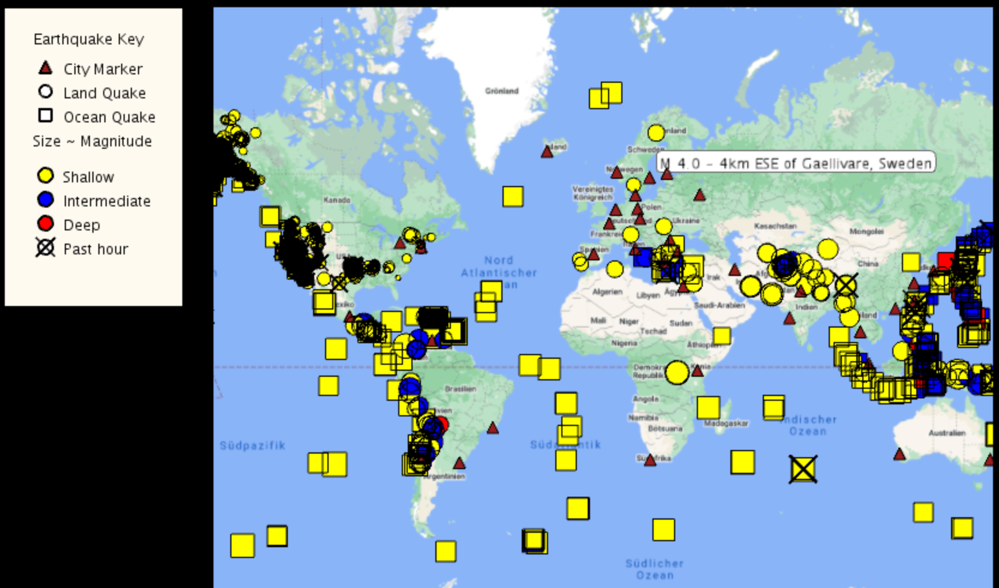

# Object Oriented Programming in Java
This course is offered by UC San Diego through Coursera, part 1 of 5 in the Java Programming: Object-Oriented Design of Data Structures specialization. 
[link to the course](https://www.coursera.org/learn/object-oriented-java).

# Project in the course
Unfolding Map Libaries and Processing Liabaries are used in Eclipse.
- Build an interactive map in Java. 
- The map read earthquake data from a live RSS feed: http://earthquake.usgs.gov/earthquakes/feed/v1.0/summary/2.5_week.atom.  
- Plot markers in the locations where earthquakes have occured and display the city.
- Additional information is displayed when the user hovers over or clicks on any marker with her/ his mouse. 
- Clicking on a marker gives even more information: A click on a city marker will lead to only that city and earthquakes 
which affect it being displayed on the map. Clicking once again on that marker will bring the rest of the map’s markers back. 

# Learning outcomes
1. Build an interactive graphical program in Java
2. Design classes to make use of object-oriented programming paradigms
3. Explain inheritance and polymorphism and how each concept is applied in the creation of a Java GUI
4. Explain how event handling works in Java, and write event handlers to create an interactive program
5. Write and apply searching and sorting algorithms to manage large data sets
6. Find and fix errors (bugs) in code
7. Develop and use test cases to ensure correctness of a program
